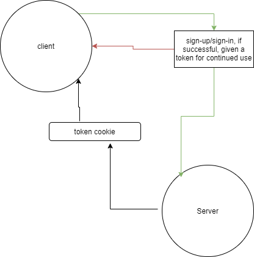

# bearer-auth

## LAB - Class 07

## Project: basic auth

### Author: Ricardo Barcenas

### Links and Resources

- [ci/cd]() (GitHub Actions)
- [Heroku Production Deployment](https://ricardob-bearer-auth.herokuapp.com/)
- [Pull request]()

### Setup

#### `.env` requirements (where applicable)

- `PORT` - 3000

#### How to initialize/run your application (where applicable)

- `npm start` to start the app

#### How to use your library (where applicable)

#### Tests

- How do you run tests?
  -  `npm test` to run the tests
- Any tests of note?
  - 

- Describe any tests that you did not complete, skipped, etc
  - app.listen needs a test

#### UML

